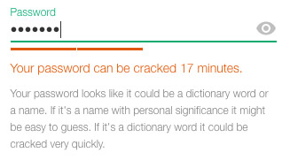
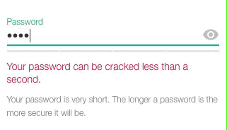

# Password Security
Password input field which displays to user how strong is the password.

### Screenshot:




### In Action:



## Check out Demo

1. Clone Repository
2. Go to directory: `cd password-security`
3. Run `npm install`
4. Run `npm run demo`
5. Go to `http://localhost:1234`

## How to integrate

### Add to head:
```html
<link rel="stylesheet" href="third-party/password-security.css">
```

### Add to before the closing body tag:
```html
<script src="third-party/hsimp.js"></script>
<script src="third-party/zxcvbn.js"></script>
<script src="third-party/password-security.min.js"></script>
```

### Use following mark up on your page:
```html
<div class="pws">
  <div class="pws__input-wrap">
    <input type="password" name="password" class="pws__input" />

    <div class="pws__visibility-switch" title="Show / Hide password"></div>

    <div class="pws__level">
      <div class="pws__bar"></div>
      <div class="pws__bar"></div>
      <div class="pws__bar"></div>
      <div class="pws__bar"></div>
    </div>
  </div>

  <div class="pws__duration">Your password can be cracked <span class="pws__duration-value"></span>.</div>
  <div class="pws__success-message">Strong one. Keep it safe.</div>
  <div class="pws__tips"></div>

</div>
```

## Roadmap
React Version coming soon.